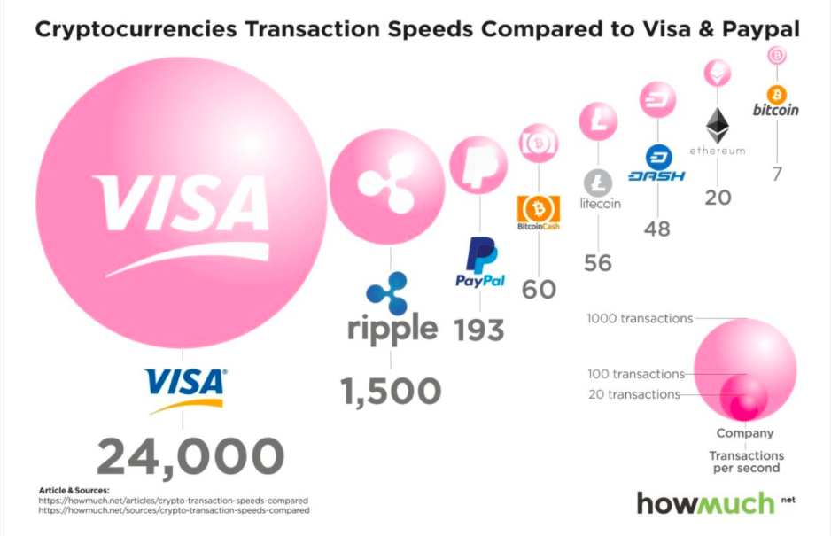
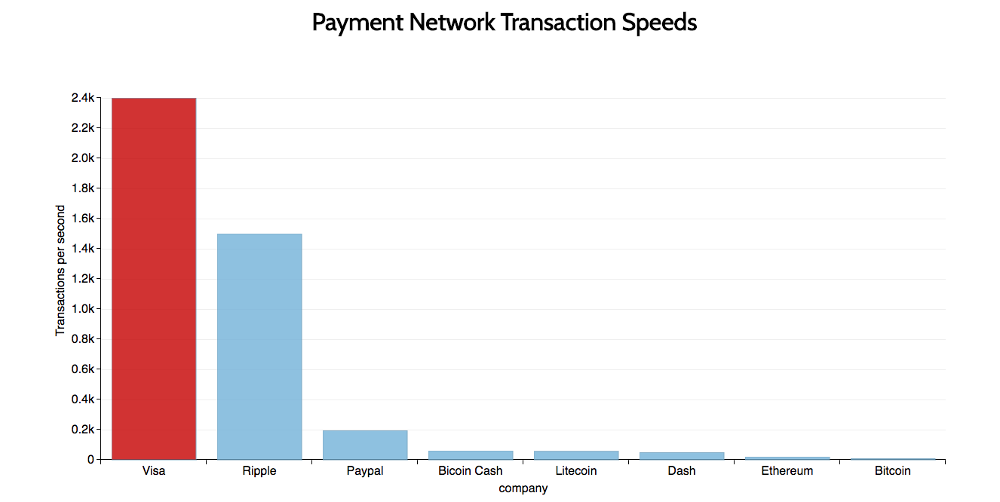

# dimple-chart
Redesigned a chart with d3 and dimple.js
 

  

 
Take a moment and observe the first chart. What do the size of the bubbles tell you about the scale of Visa's transactions in comparison to it's competitors? I may seem large but the use of a bubble chart skews the data.
 

  

 
With the implementation of d3 and dimple.js libraries, this redesigned chart more accurately conveys the descrepeny in transaction speed. 
